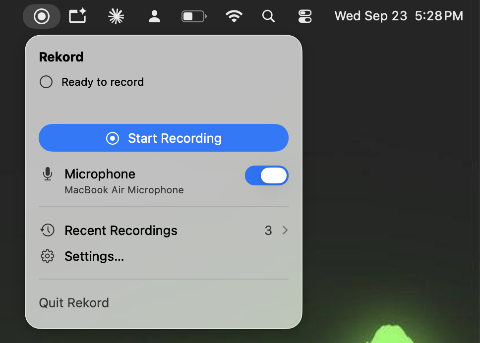
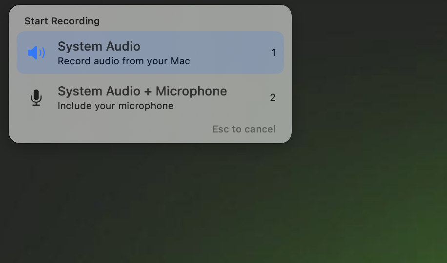
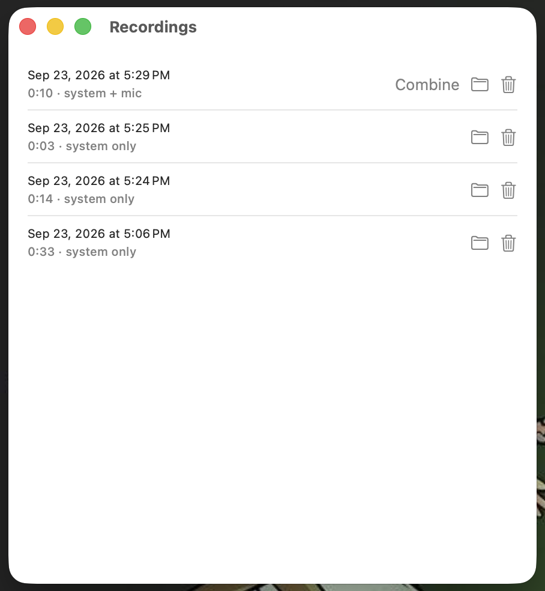
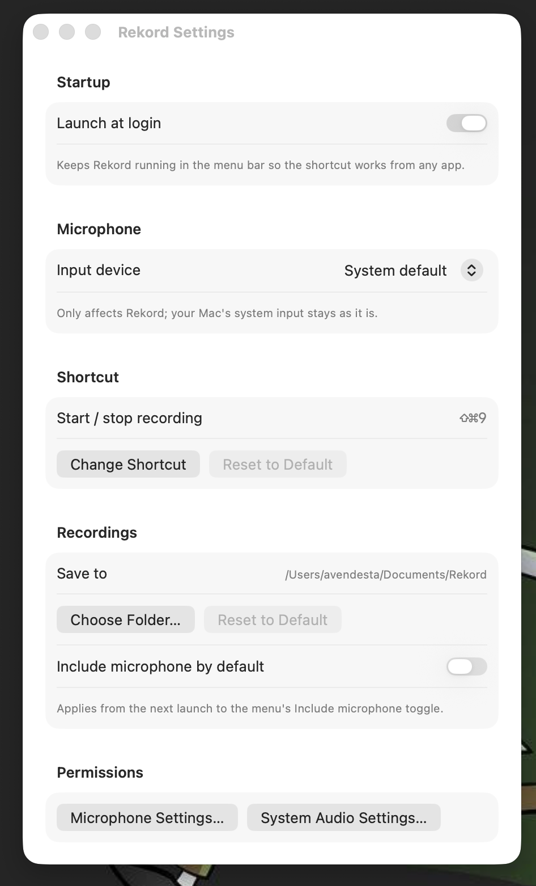

# Rekord

Record your meetings on a Mac as **two separate audio tracks**: the meeting audio (Zoom, Webex, Meet, anything playing on your Mac) and your **microphone**. Separate tracks make transcription and speaker labelling much easier. When you'd rather have one file, a single click mixes them together.

Rekord lives in the menu bar, has no Dock icon, and needs no virtual audio driver.

## Screenshots

<table>
  <tr>
    <td align="center" valign="top">
      <br>
      <sub>Menu bar popup</sub>
    </td>
    <td align="center" valign="top">
      <br>
      <sub>Shortcut popup (⇧⌘9)</sub>
    </td>
  </tr>
  <tr>
    <td align="center" valign="top">
      <br>
      <sub>Recordings</sub>
    </td>
    <td align="center" valign="top">
      <br>
      <sub>Settings</sub>
    </td>
  </tr>
</table>

## Install

1. Download the latest `Rekord-<version>.zip` from the [Releases page](../../releases/latest).
2. Unzip it and drag **Rekord** into your **Applications** folder.
3. Open Rekord. A record icon appears in the menu bar.

Rekord is signed with a Developer ID and notarized by Apple, so it opens without any security warning.

**Requires macOS 14.4 (Sonoma) or later**, on Apple silicon or Intel.

<details>
<summary>Using an older release (0.2.1 or earlier)?</summary>

Those releases were not signed, so macOS shows **"Apple could not verify “Rekord” is free of malware…"** the first time. The easiest fix is to install the latest release. To keep the old one:

1. Click **Done** (not *Move to Trash*).
2. Open **System Settings > Privacy & Security** and scroll down to the **Security** section. Click **Open Anyway** next to "Rekord was blocked", confirm with your password or Touch ID, then click **Open**.

Or, in Terminal, run `xattr -dr com.apple.quarantine /Applications/Rekord.app` and open Rekord again. On macOS 14 you can also right-click Rekord and choose **Open**.

</details>

### First launch

macOS asks for two permissions. Allow both:

- **Microphone**, to record your voice.
- **System Audio Recording**, to record the meeting audio.

If a recording's system audio comes out silent, the second permission is missing. Open **System Settings > Privacy & Security > Screen & System Audio Recording**, and turn Rekord on under *System Audio Recording Only*. Rekord also warns you about this while recording, with a button that opens that page.

## Using Rekord

**Start and stop** from the menu bar icon, or press **⇧⌘9** from any app. The shortcut opens a small popup near your cursor with two choices:

- **System Audio** (key `1`), for meetings you're only listening to.
- **System Audio + Microphone** (key `2`), for meetings you take part in.

Click a row, press `1` or `2`, or use the arrow keys and Return. Esc cancels. Rekord remembers your last choice, so **⇧⌘9** then **Return** repeats it.

Press the shortcut again during a recording to see the elapsed time and a **Stop** button. The menu bar icon's inner dot is red while recording.

**Find your recordings** under **Recent Recordings** in the menu. From there you can reveal a recording in Finder, move it to the Trash, or click **Combine** to mix both tracks into one file.

Each recording is a folder in `~/Documents/Rekord/`, named by start time:

```
2026-09-23_14-30-00/
  system.caf      meeting audio
  mic.caf         your microphone (only if it was included)
  combined.caf    both mixed together (only after you click Combine)
  session.json    start time, duration, sample rates, mic/system sync offset
```

Files are lossless `.caf` audio. If a tool you use doesn't accept `.caf`, convert it: `afconvert -f WAVE -d LEI16 system.caf system.wav` (or `ffmpeg -i system.caf system.wav`).

### Settings

Open **Settings…** from the menu to change:

- **Shortcut**, to any combination that includes ⌘, ⌥ or ⌃.
- **Microphone**, to pick a specific input device. This only affects Rekord, not your Mac's system input.
- **Save location** and whether the microphone is on by default.
- **Launch at login**, so the shortcut always works. The shortcut only works while Rekord is running.

### Tips and troubleshooting

- **Use headphones.** On speakers, the microphone also hears the meeting from the room, so it ends up on your mic track too.
- **The shortcut does nothing.** Rekord must be running (turn on *Launch at login*), and another app may already use that combination. Rekord shows a warning when it can't claim the shortcut; pick another one in Settings.
- **Nothing is recorded from other people.** Check the System Audio permission above.
- Rekord records everything your Mac plays, not just one app. Mute other audio you don't want in the file.
- Rekord doesn't detect meetings automatically. You start and stop recordings yourself. Check your local laws and get consent before recording other people.

## For developers

### Build

You need macOS 14.4+, Xcode 15.4+, and [XcodeGen](https://github.com/yonaskolb/XcodeGen) (`brew install xcodegen`). The Xcode project is generated from `project.yml` and isn't checked in.

```sh
cp Local.xcconfig.example Local.xcconfig   # put your Apple Developer Team ID in it
xcodegen generate
open Rekord.xcodeproj                      # or: xcodebuild -project Rekord.xcodeproj -scheme Rekord
```

`Local.xcconfig` is gitignored, so your Team ID stays out of the repo. Run the app from Xcode or from the built product. Debug builds print `[Rekord] ...` logs to the console.

Core Audio taps need real hardware and real permissions, so there are no automated tests for capture; test by recording.

### How it works

- **System audio:** `SystemAudioRecorder` creates a global Core Audio process tap (`AudioHardwareCreateProcessTap`, macOS 14.4+) and pairs it with the default output device in a private aggregate device, then writes the IOProc's buffers to a file. Without the System Audio permission the tap still runs but delivers zeros, so `sawAudio` tracks whether any real signal arrived.
- **Microphone:** `MicRecorder` taps an `AVAudioEngine` input node, writing on its own queue. It can point that engine at a chosen device without changing the system default.
- **Session:** `RecordingSession` starts both, records each track's first-buffer host time so `session.json` can store the sync offset, and rolls back on any start failure.
- **Combine:** `CombineEngine` mixes the tracks offline with `AVAudioEngine` manual rendering, padding whichever track started later.
- **Shortcut:** `HotkeyManager` uses Carbon's `RegisterEventHotKey`, which works globally without Accessibility permission.

```
Rekord/
  App/       RekordApp: menu bar scene, windows
  Audio/     SystemAudioRecorder, MicRecorder, RecordingSession, CombineEngine,
             AudioInputDevices, PermissionsManager
  Models/    Recording, RecordingStore, AppSettings
  UI/        MenuBarView, RecordingsWindowView, RecordingRowView, SettingsView,
             HotkeyManager, HotkeyPopupView
  Resources/ Info.plist, Assets.xcassets
project.yml  XcodeGen project definition
```

### Constraints

- Rekord is **unsandboxed**: the process tap API isn't documented as sandbox-compatible, so it can't be on the Mac App Store. Releases are Developer ID signed and notarized; see [RELEASING.md](RELEASING.md).
- The tap captures the whole system output, not a single app.

### Releasing

See [RELEASING.md](RELEASING.md).

## License

[MIT](LICENSE)
